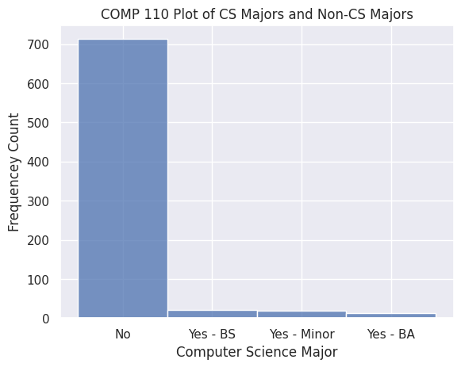
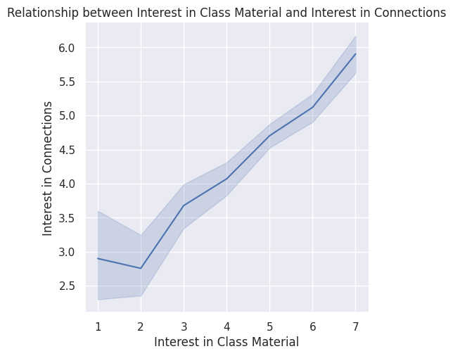
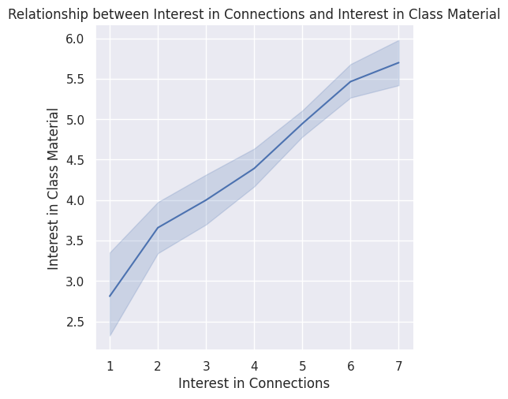
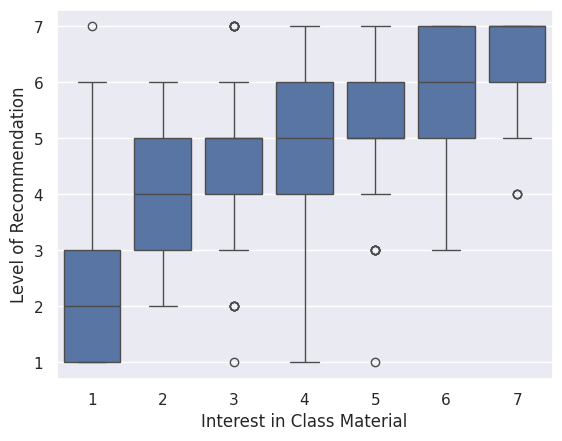
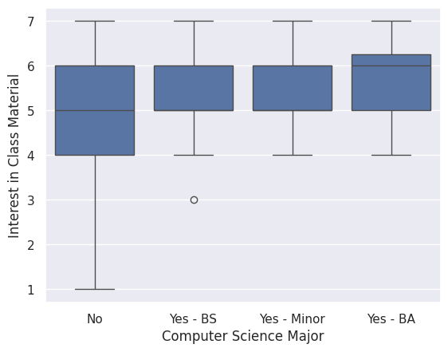
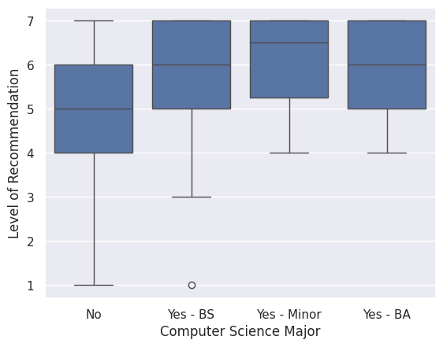

---
# Do not edit the text between these lines!
layout: default
---

# Data Analysis

<!-- This is a comment. Below, you'll see code for inserting an image. To make this image appear, update <custom-path>. To add an image, save it inside the imgs folder of this repository. -->

## Figure 1

From the data above, one can determine that a large portion of people currently in COMP 110 are not computer science majors. As it stands, recognizing this provides a great opportunity for instructurs to introduce students to field-specific applications of programming and potentially help them develop an interest in developing interdiscplinary skills with computer science and their respective majors/fields of interest. For the next section, I will analyze data related to students ratings of interest in learning about connections between computer science and other fields.

## Figure 2

## Figure 3

## Figure 4

The first visualization above is a histogram for measures of interest in class material, overlayed with ratings for interest in across disciplines. The legend depicts ligher colors as representing lower ratings for interest in connections, and darker colors as representing higher ratings for interest in connections. The histogram indicates that higher ratings for class interest are associated with higher ratings in interest for connections across disciplines. The following two visualizations show the relationship between interest in class material and interest in connections (and vice versa). These relplots indicate that their is linear relationship between both variables.

## Figure 5 

The boxplot above indicates that median responses for level of recommendation according to interest in class material. Median levels of recommendation increase as interest in class material increases. 

## Figure 6

The boxplot above shows interest in class material according to whether or not the student is a computer science major. This boxplot shows that while median ratings of interest in class interest are similar across major groups, there also exists much greater variability for students that are not computer science majors. This indicates an area of improvement, where reducing variability in favor of higher interest in class material would increase mean ratings for COMP 110 from non-cs majors. 

## Figure 7 

The boxplot above shows level of recommendation according to major group, with lower median rating for level of recommendation among non-cs majors and higher variability. Computer science majors have a higher level of recommendation and with less variability. This indicates that non-cs majors tend to recommend COMP 110 less than cs-majors/minors. Increasing median level of recommendation and/or decreasing variability (in favor of recommending COMP 110) is an area of improvement. 

## Conclusion

In conclusion, there is reasonable evidence to suggest that introducing applications of programming across disciplines would benefit students interest in class material, as well as improve levels of recommendation, and promote interest in computer science. Firstly, the histogram displaying computer science majors and non-compsci majors indicates that an overwhelming majority of students currently in COMP 110 are not computer science majors. This figure identifies a key stakeholder group for COMP 110: non-compsci majors. Secondly, data suggests that there is a relationship between interest in class material and interest in class material. This relationship is seemingly bidirectional, which indicates that increase in either variable is asociated with each other. This suggests promoting interest in the connections between computer science and other fields would greatly benefit how interesting the class is to students. Promoting interest in class material is also associated with levels of recommending COMP 110. As shown by the boxplot graphing level of recommendation according to interest in the class material, median recommendation levels increase as interest in class material increases. Naturally, improving interest in class material would benefit the department as more students would be willing to recommend the class. Finally, it there is lower median interest in class material and recommendation levels for non-compsci majors, as well as greater variability with responses for both factors. The inverse is true for computer science majors. This indicates that non-compsci majors are less interested in class material and less inclined to recommend COMP 110. Moreover, greater variability trending toward lower ratings for both features. Oncemore, this shows an area of improvement for non-compsci students. While the data could be more conclusive, I think the idea is intuitively logical and would provide benefit to students, the computer science department, and society at large. Introducing different applications across fields would benefit students' interest in the class and perhaps promote interest in the field. Data collection could ask whether or not students are interested in taking other computer science courses directly for more conclusive data. Treating this question as separate from whether or not a student is a computer science major is important because some people may be interested in other computer science classes without having the desire to major or minor in computer science. Additionally, the computer science department would benefit from having students across different disciplines interested in computer science. Innovation thrives when people with different bases of knowledge work together, especially in research. Diverse perspectives are important in computer science, as its applications are also diversifying more and more. Overall, I think introducing students to interdisciplinary applications of programming and computer science would benefit student outcomes and garner interest in the field, benefiting the computer science department and society at large. 

