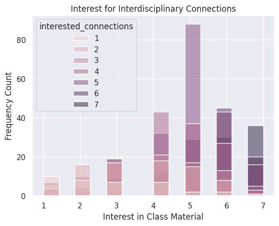

---
# Do not edit the text between these lines!
layout: default
---

# Data Analysis

<!-- This is a comment. Below, you'll see code for inserting an image. To make this image appear, update <custom-path>. To add an image, save it inside the imgs folder of this repository. -->
/static/imgs/logo.png" alt="Image of Comp110 rainbow logo. "  width="500"/>

## Figure 1

This is basic paragraph text. lalalallaa

